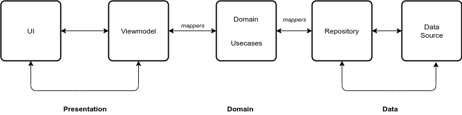
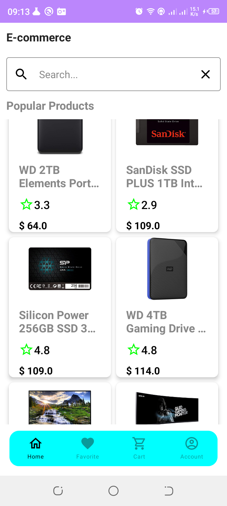
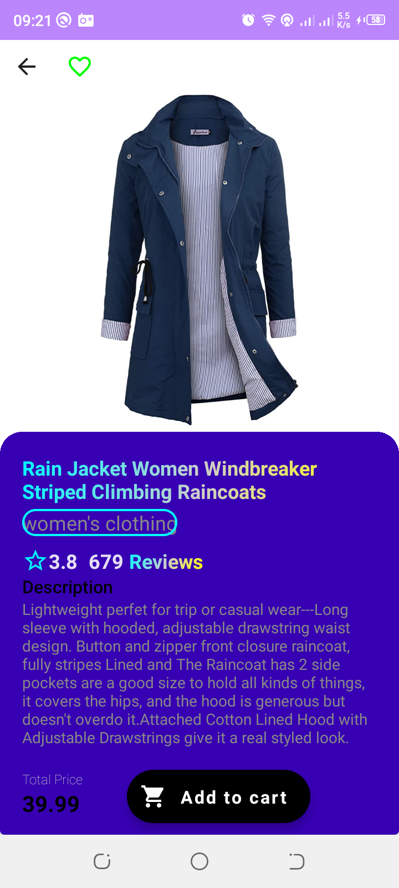
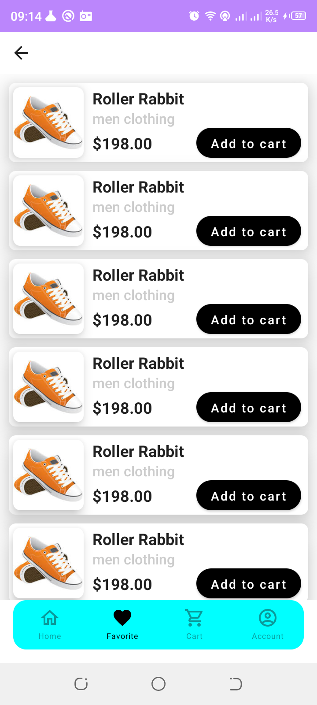
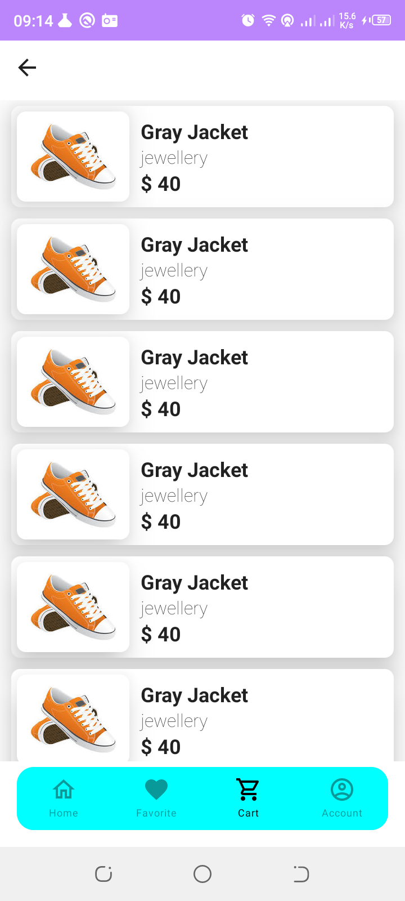

## E-CommerceApp
- An Android application consuming [Fake Store API](https://fakestoreapi.com/) to demonstrate E-commerce application functionalities. 
- Build System: [Gradle](https://gradle.org/).
- Minimum API Level: 21 [Supports Over 84% Devices](https://developer.android.com).
 

## Table of Contents
- [Prerequisite](#prerequisite)
- [Architecture](#architecture)
- [TechStack](#techstack)
- [ScreenShots](#screenshots)
- [Todo](#todo)
 

## Prerequisite
- Android Studio
- Kotlin
 

## Architecture

## TechStack
- [Kotlin](https://kotlin.org) - Modern but already mature programming language aimed to make developers happier. It's concise, safe, interoperable with Java and other languages, and provides many ways to reuse code between multiple platforms for productive programming.
- [Jetpack Components](https://developer.android.com/jetpack)
    - [Jetpack Compose](https://developer.android.com/jetpack/compose) - Modern toolkit for building native UI.
    - [Android KTX](https://developer.android.com/kotlin/ktx.html) - Provide concise, idiomatic Kotlin to Jetpack and Android platform APIs.
    - [AndroidX](https://developer.android.com/jetpack/androidx) - Major improvement to the original Android [Support Library](https://developer.android.com/topic/libraries/support-library/index), which is no longer maintained.
        -   [Lifecycle](https://developer.android.com/topic/libraries/architecture/lifecycle) - Perform actions in response to a change in the lifecycle status of another component, such as activities and fragments.
        -   [ViewModel](https://developer.android.com/topic/libraries/architecture/viewmodel) - Designed to store and manage UI-related data in a lifecycle conscious way. The ViewModel class allows data to survive configuration changes such as screen rotations.
    - [Room](https://developer.android.com/training/data-storage/room) - Provides an abstraction layer over SQLite used for offline data caching.
    - [Hilt](https://developer.android.com/training/dependency-injection/hilt-android) - is a dependency injection library for Android that reduces the boilerplate of doing manual dependency injection in your project.
- [Retrofit](https://square.github.io/retrofit/) - Type-safe http client and supports coroutines out of the box.
- [GSON](https://github.com/square/gson) - JSON Parser,used to parse requests on the data layer for Entities and understands Kotlin non-nullable and default parameters.
- [Coil](https://coil-kt.github.io/coil/) - Image Loading Library
- [OkHttp-Logging-Interceptor](https://github.com/square/okhttp/blob/master/okhttp-logging-interceptor) - Logs HTTP request and response data.
- [Coroutines](https://github.com/Kotlin/kotlinx.coroutines) - Library Support for coroutines.
- [kotlinx.coroutines](https://github.com/Kotlin/kotlinx.coroutines) - Library Support for coroutines,provides runBlocking coroutine builder used in tests.
- [Raamcosta](https://github.com/raamcosta/compose-destinations) - It hides the complex, non-type-safe and boilerplate code you would have to write otherwise.
- [Flow](https://developer.android.com/kotlin/flow) - Flows are built on top of coroutines and can provide multiple values. A flow is conceptually a stream of data that can be computed asynchronously.
 

## Screenshots
<table>
<thead>
<tr>
<th align="center">Product Screen</th>
<th align="center">Detail Screen</th>
<th align="center">Favorite Screen</th>
<th align="center">Cart Screen</th>
</tr>
</thead>
<tbody>
<tr>
<td></td>
<td></td>
<td></td>
<td></td>
</tr>
</tbody>
</table>

## Todo

